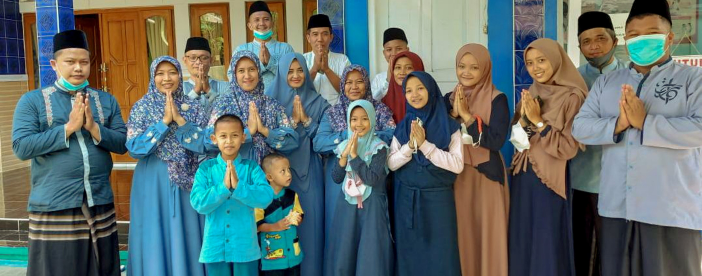

LEBARAN IDUL FITRI 20222

<head>
    <title>Document</title>
    <link href="https://fonts.googleapis.com/css?family=Dancing+Script" rel="stylesheet">
    <link href="./style.css" rel="stylesheet">

</head>
<body>
    
 
         
        <h2>KELUARGA BESAR</h2>
        <h1>BANI THOHA MURTADLO</h1>
        
Mengucapkan

     
        <h1>.:  SELAMAT HARI RAYA IDUL FITRI 1443 H :.</h1>
         
" Bulan suci Ramadan telah berlalu, fajar hari kemenangan tampak mewarnai langit, membawa sinar kedamaian dan kesucian. Selamat idul fitri 1443 H. Mohon Maaf Lahir dan Batin

    <footer style="text-align: center;">
        
1443 H/2022 M

 
